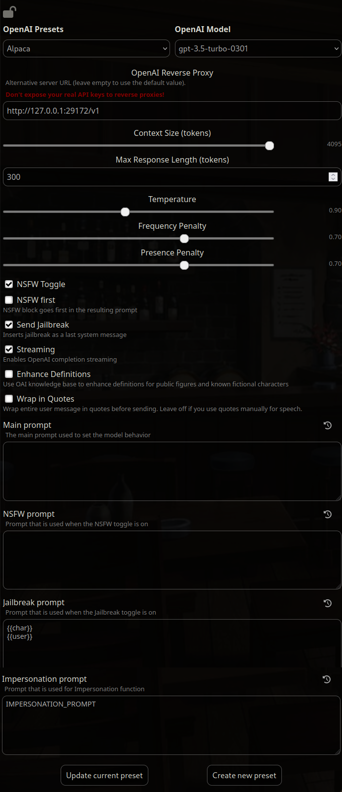

# Fake OpenAI API for Kobold

``` sh
npm install
node index.mjs
```

## Tavern Settings
In Tavern:
+ Select OpenAI API
+ Put "test" or whatever as API key.
+ In presets create a new one called "Alpaca".
+ Set OpenAI Reverse Proxy to http://127.0.0.1:29172/v1
+ Delete Main Prompt, NSFW Prompt, Jailbreak Prompt, Impersonation Prompt.
+ Change Impersonation Prompt to "IMPERSONATION_PROMPT".
+ Change Jailbreak Prompt to "{{char}}\n{{user}}".
+ Leave only NSFW Toggle and Send Jailbreak active.

## Tavern Settings Screenshot

