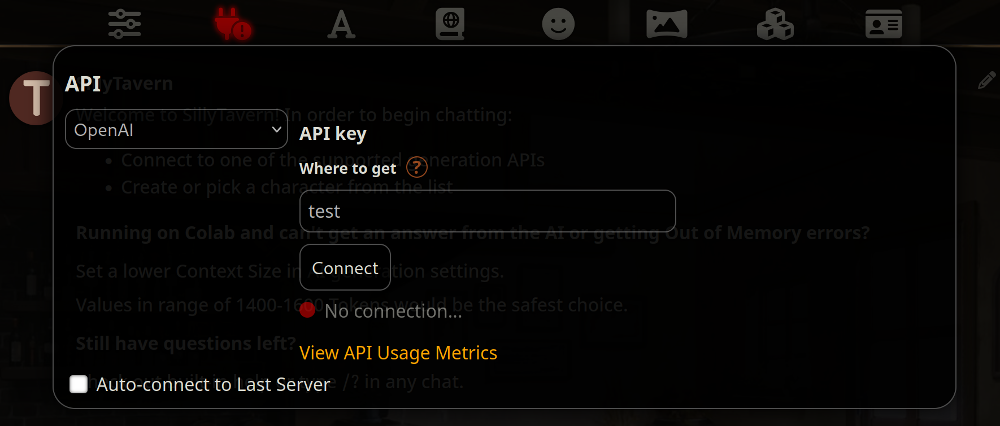

# Fake OpenAI API for Kobold

This script changes the format of the prompt and it improves the responses when using SillyTavern. The LLaMA tokenizer needs a modern Node.js version to work, I use v19 myself.

Clone this repository anywhere in your computer and run this inside the directory:

```sh
npm install
node index.mjs
```

You can replace the last line to this if you want it to reload automatically when editing the file:

```sh
npx nodemon index.mjs
```

## Tavern Settings

After pressing the second buttom of the top panel select "OpenAI" as the API and write a random api key, it doesn't matter.


Press the first button and scroll to the bottom, there's a "Create new preset" button, create one called "Alpaca."

- Scroll up and set "OpenAI Reverse Proxy" to http://127.0.0.1:29172/v1
- Delete Main Prompt, NSFW Prompt, Jailbreak Prompt, Impersonation Prompt.
- Change Impersonation Prompt to "IMPERSONATION_PROMPT".
- Change Jailbreak Prompt to "{{char}}\n{{user}}".
- Leave only NSFW Toggle and Send Jailbreak active, and Streaming if you want that too.


Press the second button from the top panel again and select Connect.

## Notes

Leave Context Size high so Tavern doesn't truncate the messages, we're doing that in this script.

Tavern settings like Temperature, Max Response Length, etc. are ignored, edit _generationConfig_ in the code instead.
There's also a _replyAttributes_ variable that makes the AI give the more descriptive responses.

If you want to always keep the example messages of the character in the prompt you have to edit _keepExampleMessagesInPrompt_ in index.mjs while also enabling the option in the Tavern UI.

The last prompt is saved as prompt.txt, edit the _buildLlamaPrompt_ function to experiment with the format.

Streaming works for ooba and koboldcpp. Kobold doesn't support streaming nor stopping strings.

Ooba needs to be started with --extensions api and the streaming api was added Apr 23, 2023.
