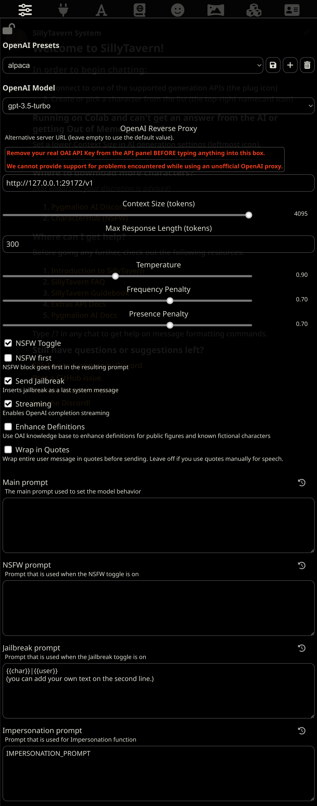
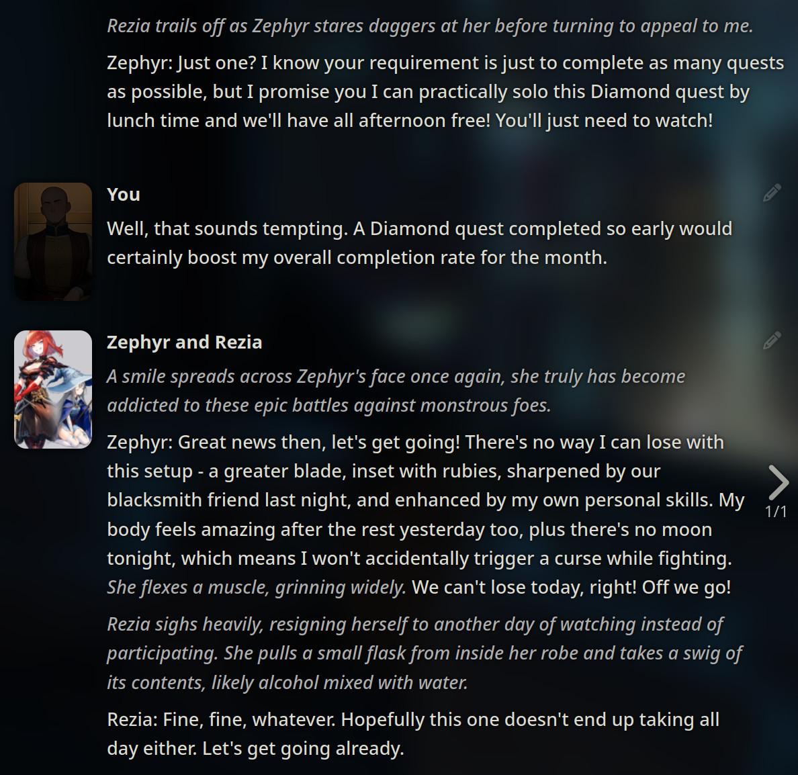

# Fake OpenAI API for Kobold

_A workaround to have more control over the prompt format when using SillyTavern and local models._

This script sits between SillyTavern and a backend like Kobold and it lets you change how the final prompt text will look. By default, it includes a prompt format that works well with LLaMA models tuned to follow instructions. It does this by presenting itself to SillyTavern as an OpenAI API, processing the conversation, and sending the prompt text to the backend.

The LLaMA tokenizer needs a modern Node.js version to work. Use the latest **LTS** version of [Node.js](https://nodejs.org).

You need a local backend like [KoboldAI](https://github.com/0cc4m/KoboldAI), [koboldcpp](https://github.com/LostRuins/koboldcpp) or [Ooba in API mode](https://github.com/oobabooga/text-generation-webui) to load the model, but it also works with the [Horde](http://koboldai.net/), where people volunteer to share their GPUs online.

## Table of Contents

- [Installation](#installation)
  - [Tavern Settings](#tavern-settings)
    - [Configuration File](#configuration-file)
    - [Manual](#manual)
  - [Notes](#notes)
- [File Structure](#file-structure)
- [Examples](#examples)
- [Changelog](#changelog)

## Installation

You'll need SillyTavern, the proxy, and a backend running. This guide is for the proxy.

- Install the LTS version of [Node.js](https://nodejs.org).
- Clone this repository with Git, or click on Code -> [Download ZIP](https://github.com/anon998/simple-proxy-for-tavern/archive/refs/heads/main.zip) and extract it anywhere on your computer.
- On Windows, open the folder you extracted or cloned and double-click _start.bat_
- On Linux, navigate to the directory with a terminal and run _./start.sh_

Copy the file **config.default.mjs** to **config.mjs** if you want to make changes to the config. That way they aren't lost during updates.
If you're going to use the Horde, set your key and the models you want to use there.

There are now generation and prompt formats presets in the _presets/_ and _prompt-formats/_ folders.

### Tavern Settings

Download <a href="https://raw.githubusercontent.com/anon998/simple-proxy-for-tavern/main/img/alpaca.settings">alpaca.settings</a> and put it in SillyTavern/public/OpenAI Settings/ and reload or start Tavern. Some of the values in the next steps will already be complete.

After pressing the second button of the top panel, select "OpenAI" as the API and write a random API key; it doesn't matter.

Press the first button and select the "alpaca" preset. If it was already selected, you might need to change to Default and then back to alpaca for the settings to load correctly.

If it doesn't exist, create one. In older versions, the button might be at the bottom of that panel or to the right of the select box.

- Scroll up and set "OpenAI Reverse Proxy" to http://127.0.0.1:29172/v1
- Delete the default Main Prompt and NSFW Prompt.
- Change Jailbreak Prompt to "{{char}}|{{user}}". If you want to add your own text there, do it on the second line.
- Change Impersonation Prompt to "IMPERSONATION_PROMPT".
- On the checkboxes above, enable NSFW Toggle and Send Jailbreak.
- Enable Streaming too if you want that.

Press the second button from the top panel again and select "Connect".

### Notes

Leave Context Size high so Tavern doesn't truncate the messages, we're doing that in this script.

Tavern settings like Temperature, Max Response Length, etc. are ignored. Edit _generationPreset_ in conf.mjs to select a preset. The presets are located in the presets/ directory.
There's also a _replyAttributes_ variable that, by default, alters the prompt to induce the AI into giving more descriptive responses.

If you want to always keep the example messages of the character in the prompt, you have to edit _keepExampleMessagesInPrompt_ in conf.mjs while also enabling the option in the Tavern UI.

The last prompt is saved as **prompt.txt**. You can use it to check that everything is okay with the way the prompt is generated.

Streaming works for ooba and koboldcpp. Kobold doesn't support streaming or stopping strings.

Ooba needs to be started with --extensions api and the streaming API was added Apr 23, 2023.

## Files

- **config.default.mjs**: default settings
- **config.mjs**: user settings, if exists
- **src/index.mjs**: proxy code
- **src/horde.mjs**: horde code
- **presets/\*.json**: AI generation presets. The defaults come from Kobold.
- **prompt-formats/\*.mjs**: functions to build the prompt
- **tokenizer.model**: LLaMA tokenizer model from huggingface.

## Examples

[Rentry with examples from /lmg/](https://rentry.org/llama-examples)

## Changelog

[changelog](./CHANGELOG.md)
